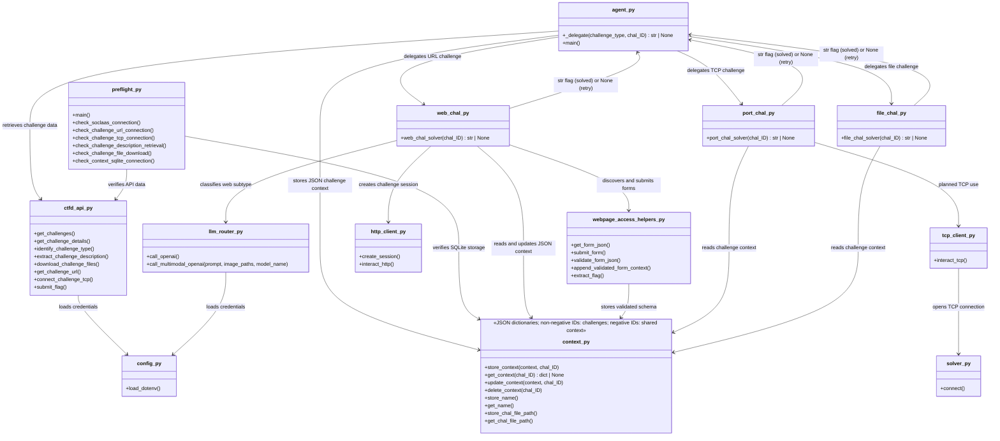

# Installation

## Local setup (PowerShell)

```powershell
git clone https://github.com/HisFun2305/incypher_agent_NameError.git
cd incypher_agent_NameError
python -m venv venv
.\venv\Scripts\Activate.ps1
pip install -r requirements.txt
Copy-Item .env.example .env
```

Configure `.env` with your credentials. For SOCLAAS, follow [https://dochub.comp.nus.edu.sg/cf/guides/soclaas/start](https://dochub.comp.nus.edu.sg/cf/guides/soclaas/start) (You need to be on NUS wifi or be logged into the NUS VPN):

```dotenv
IN_CYPHER_DOCKER_PLATFORM_AVAILABLE=false
SOCLAAS_API_KEY=your_soclass_api_key
SOCLAAS_BASE_URL=https://your-soclass-compatible-api/v1
CTFD_API_TOKEN=your_ctfd_token
PLATFORM_URL=https://hackathon.in-cypher.com
TEAM_KEY=your_team_key
```

## Docker setup

```powershell
docker build -t incypher-agent:latest .
docker run --rm -it `
  -e IN_CYPHER_DOCKER_PLATFORM_AVAILABLE="false" `
  -e SOCLAAS_API_KEY="your_soclass_api_key" `
  -e SOCLAAS_BASE_URL="https://your-soclass-compatible-api/v1" `
  -e CTFD_API_TOKEN="your_ctfd_token" `
  -e PLATFORM_URL="https://hackathon.in-cypher.com" `
  -e TEAM_KEY="your_team_key" `
  --name agent_runner `
  incypher-agent:latest
```

## Module diagram

For a concise reference of the public methods, see [METHODS.md](METHODS.md).


